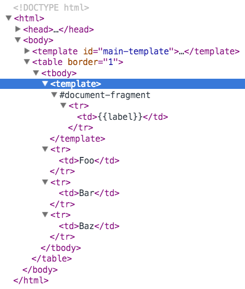

# Conditional template instnatiation


`<template>` can be instantiated conditionally with `<template if="{{condition}}">` syntax, for example:


<iframe width="100%" height="200" src="http://jsfiddle.net/ibmjs/VBW26/embedded/html,js,result" allowfullscreen="allowfullscreen" frameborder="0"><a href="http://jsfiddle.net/ibmjs/VBW26/">checkout the sample on JSFiddle</a></iframe>


`<template if="{{condition}}">` inherits the data model from containing `<template>` by default. You can explicitly specify `bind="{{model}}"` to use a different model, or use `repeat="{{observableArray}}"` to generate repeating template instance by the condition.


# Template reference

`<template>` can refer to another `<template>` so that the content of the latter `<template>` is instantiated next to the former `<template>`. Below example uses the same template for single template instantiation as well as repeating template instantiation:

<iframe width="100%" height="250" src="http://jsfiddle.net/ibmjs/DUrn5/embedded/html,js,result" allowfullscreen="allowfullscreen" frameborder="0"><a href="http://jsfiddle.net/ibmjs/DUrn5/">checkout the sample on JSFiddle</a></iframe>

# Attribute template

Browsers that don't natively support `<template>` don't allow you to place `<template>` at the place of `<tr>`, `<td>`, `<option>`, etc. It prevents you from repeatedly creating those elements though you'll need them often. To address that issue, liaison handles a special HTML syntax that turns a regular HTML element to a template. Below template creates multiple `<tr>`s when it's instantiated:

<iframe width="100%" height="200" src="http://jsfiddle.net/ibmjs/CDx82/embedded/html,js,result" allowfullscreen="allowfullscreen" frameborder="0"><a href="http://jsfiddle.net/ibmjs/CDx82/">checkout the sample on JSFiddle</a></iframe>

Under the hood, attribute template creates a `<template>` with attribute template's content (including the element with `template` attribute itself), like below:

